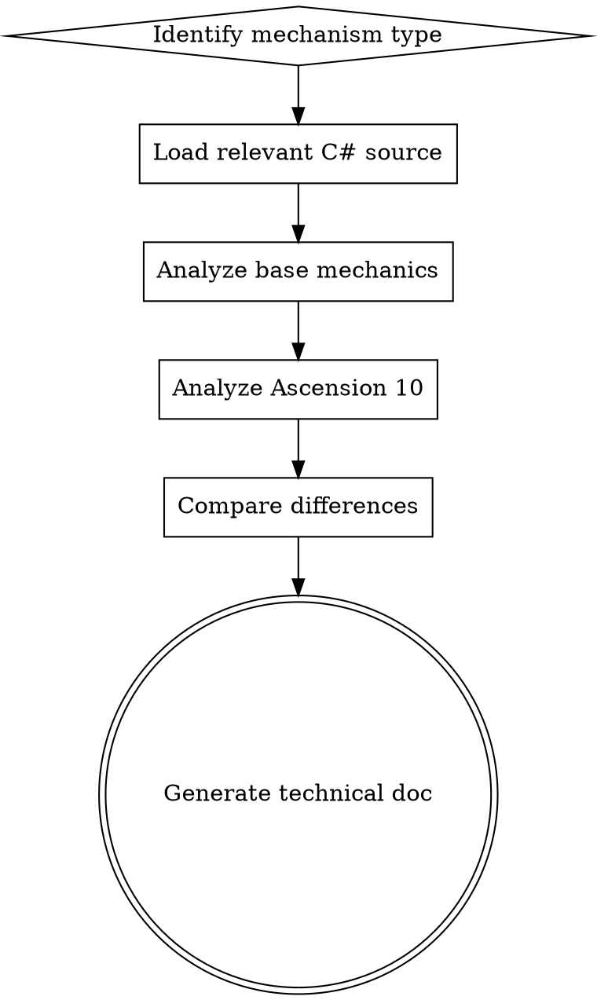

# Analyze STS2

## Overview
Analyze Slay the Spire 2 game mechanics by reading decompiled C# source code from `extraction/decompiled/`. All analysis must be code-based, never from web searches or assumptions.

## When to Use

Use this skill when:
- Analyzing card mechanics (rarity odds, card pools, upgrades, keywords)
- Investigating combat systems (damage calculation, blocking, powers, intents)
- Studying monster behaviors (AI state machines, move patterns, ascension changes)
- Exploring roguelike elements (map generation, rewards, relic/potion drops)
- Comparing base mechanics vs Ascension 10 difficulty

## Core Pattern

### Analysis Workflow



### Key Namespaces

| Mechanism Type | Key Namespaces | Key Classes |
|---|---|---|
| **Card Mechanics** | `MegaCrit.Sts2.Core.Odds`, `MegaCrit.Sts2.Core.Entities.Cards` | `CardRarityOdds`, `CardRarity`, `CardType` |
| **Combat Systems** | `MegaCrit.Sts2.Core.Combat`, `MegaCrit.Sts2.Core.Entities.Powers` | `PowerStackType`, `PowerType` |
| **Monster Behaviors** | `MegaCrit.Sts2.Core.MonsterMoves`, `MegaCrit.Sts2.Core.Models.Monsters` | `MonsterMoveStateMachine`, `GenerateMoveStateMachine()` |
| **Roguelike Elements** | `MegaCrit.Sts2.Core.Map`, `MegaCrit.Sts2.Core.Rewards` | `RunOddsSet`, `UnknownMapPointOdds` |
| **Ascension** | `MegaCrit.Sts2.Core.Entities.Ascension` | `AscensionLevel`, `AscensionHelper` |

## Quick Reference

### Analysis Templates

**Templates are located in `~/.agents/skills/analyze-sts2/templates/`**

#### Combat Mechanics Template
File: `templates/combat_mechanics.md`

Analysis points:
1. Damage calculation logic (formulas, modifiers)
2. Blocking mechanics (calculation, decay)
3. Power system (stacking, interactions)
4. Intent system (monster intents, icons)

#### Card Mechanics Template
File: `templates/card_mechanics.md`

Analysis points:
1. Card rarity odds (regular/elite/boss/shop)
2. Card pool composition (character-specific, universal)
3. Card upgrade mechanics (value changes, effect changes)
4. Keyword system (exhaust, ethereal, innate, etc.)

#### Monster Mechanics Template
File: `templates/monster_mechanics.md`

Analysis points:
1. Monster AI state machines (loop/random/conditional)
2. Move patterns (attack/block/buff/debuff/summon)
3. Ascension difficulty changes (value adjustments, behavior changes)
4. Encounter pools (act distribution, room types)

#### Roguelike Mechanics Template
File: `templates/roguelike_mechanics.md`

Analysis points:
1. Map generation (room type distribution, path algorithms)
2. Reward allocation (cards, relics, potions, gold)
3. Relic pools (boss relics, shop relics, event relics)
4. Potion drops (character-specific, universal potions)

**Using Templates:**
1. Read the appropriate template file
2. Follow the structure and checklist
3. Fill in values extracted from source code
4. Include code references for all claims
5. Complete the checklist at the end of each template

### Ascension Comparison

**Critical Rule:** Ascension 10 includes ALL mechanics changes from levels 0-10. When comparing, always check:
- `AscensionHelper.GetValueIfAscension(AscensionLevel.Scarcity, baseValue, ascensionValue)`
- Conditional logic based on `AscensionLevel` enum
- Monster move pattern changes in `GenerateMoveStateMachine()`

## Implementation

### Mandatory Analysis Steps

1. **Load Source Code**: Read relevant C# files from `extraction/decompiled/`
   - Use `find extraction/decompiled -name "*.cs"` to discover files
   - Focus on namespaces listed in "Key Namespaces" section
   
2. **Identify Key Classes**: Find classes related to mechanism being analyzed
   - Look for class definitions with `public class` keyword
   - Check inheritance hierarchies with `: BaseClass` syntax
   
3. **Trace Logic Flow**: Follow method calls and inheritance hierarchies
   - Track method calls within classes
   - Follow `base.Method()` calls to parent classes
   - Note interface implementations
   
4. **Extract Values**: Note all constants, formulas, and conditional logic
   - Extract `const` and `readonly` field values
   - Document `if/else` conditional branches
   - Note mathematical formulas and calculations
   
5. **Check Ascension**: Look for `AscensionHelper` calls and ascension-level conditionals
   - Search for `AscensionHelper.GetValueIfAscension()` calls
   - Check for `AscensionLevel` enum comparisons
   - Note `AscensionLevel.Scarcity` (level 8) references
   
6. **Document References**: Cite specific file paths and line numbers
   - Format: `Namespace/ClassName.cs:line_number`
   - Use relative paths from `extraction/decompiled/`
   - Include line numbers for all claims

### Output Format

Generate detailed technical documentation with:

- **Mechanism Overview**: One-sentence description
- **Core Logic**: Code snippets + explanations
- **Value Parameters**: Tables of constants and variables
- **Ascension Differences**: Comparison tables (base vs Ascension 10)
- **Code References**: `file_path:line_number` format
- **Interaction Notes**: Relationships with other mechanics

### File Discovery Patterns

**Use these commands to find relevant files:**

```bash
# Find all files in a namespace
find extraction/decompiled -path "*/MegaCrit.Sts2.Core.Odds/*" -name "*.cs"

# Find files containing specific class
find extraction/decompiled -name "*CardRarity*.cs"

# Search for specific methods or patterns
grep -r "AscensionHelper.GetValueIfAscension" extraction/decompiled/

# Find enum definitions
grep -r "enum.*AscensionLevel" extraction/decompiled/
```

### Value Extraction Patterns

**When extracting values from code, look for:**

1. **Constants**: `public const float Value = 0.5f;`
2. **Static Fields**: `public static float regularCommonOdds = ...;`
3. **Conditional Values**: `AscensionHelper.GetValueIfAscension(AscensionLevel.Scarcity, baseValue, ascensionValue)`
4. **Switch Statements**: Pattern matching for different cases
5. **Mathematical Operations**: Formulas and calculations

**Example extraction from CardRarityOdds.cs:13:**
```csharp
public static float regularCommonOdds = AscensionHelper.GetValueIfAscension(
    AscensionLevel.Scarcity,  // Ascension 10
    0.615f,                 // Base value
:   0.6f                    // Ascension 10 value
);
```

**Interpretation**: Base = 60%, Ascension 10 = 61.5%

### Example: Card Rarity Analysis

```markdown
## Card Rarity Odds

**Source**: `MegaCrit.Sts2.Core.Odds/CardRarityOdds.cs:13-41`

### Base Mechanics

| Encounter Type | Common | Uncommon | Rare |
|---|---|---|---|
| Regular | 61.5% | 37% | 1.49% |
| Elite | 54.9% | 40% | 5% |
| Boss | 0% | 0% | 100%[1] |
| Shop | 58.5% | 37% | 4.5% |

### Ascension 10 Changes

| Encounter Type | Common | Uncommon | Rare |
|---|---|---|---|
| Regular | 60% | 37% | 3% |
| Elite | 50% | 40% | 10% |
| Boss | 0% | 0% | 100% |
| Shop | 54% | 37% | 9% |

**Code Reference**: `CardRarityOdds.cs:33-41`

### Rarity Growth System

- **Base Growth**: 1% per card roll (base), 0.5% (Ascension 10)
- **Max Offset**: 40%
- **Reset Condition**: Rare card resets offset to -5%

**Code Reference**: `CardRarityOdds.cs:31,53-65`
```

## Common Mistakes

| Mistake | Fix |
|---|---|
| Using web search or game wikis | Only use `extraction/decompiled/` C# source |
| Guessing values or formulas | Extract exact values from code |
| Ignoring ascension changes | Always check `AscensionHelper` calls |
| Missing code references | Cite `file:namespace/ClassName.cs:line_number` for all claims |
| Analyzing in isolation | Note interactions with other mechanics |
| Assuming Ascension 10 = level 10 | Ascension 10 includes ALL changes from 0-10 |
| Using full absolute paths | Use relative paths from `extraction/decompiled/` |
| Missing line numbers | Always include line numbers in references |
| Not verifying enum values | Check enum definitions for exact values (e.g., Scarcity = 8) |

## Red Flags - STOP and Verify

- Analysis without code citations
- Values not found in source code
- Missing ascension comparison
- Using web resources as sources
- Claims without `file_path:line_number` references

**All of these mean: Re-read source code and fix the analysis.**

## Usage Example

**User Request**: "Analyze the card rarity odds system in Slay the Spire 2"

**Analysis Process**:

1. **Load Template**: Read `templates/card_mechanics.md`
2. **Discover Files**:
   ```bash
   find extraction/decompiled -path "*/MegaCrit.Sts2.Core.Odds/*" -name "*.cs"
   # Result: CardRarityOdds.cs, AbstractOdds.cs, etc.
   ```
3. **Read Source Code**:
   - `MegaCrit.Sts2.Core.Odds/CardRarityOdds.cs`
   - `MegaCrit.Sts2.Core.Entities.Ascension/AscensionLevel.cs`
4. **Extract Values**:
   - Find `AscensionHelper.GetValueIfAscension()` calls
   - Extract base and ascension values
   - Note rarity growth parameters
5. **Generate Documentation**: Follow template structure
6. **Complete Checklist**: Verify all items in template checklist are completed

**Expected Output**: Technical documentation with tables, code references, and ascension comparisons.
